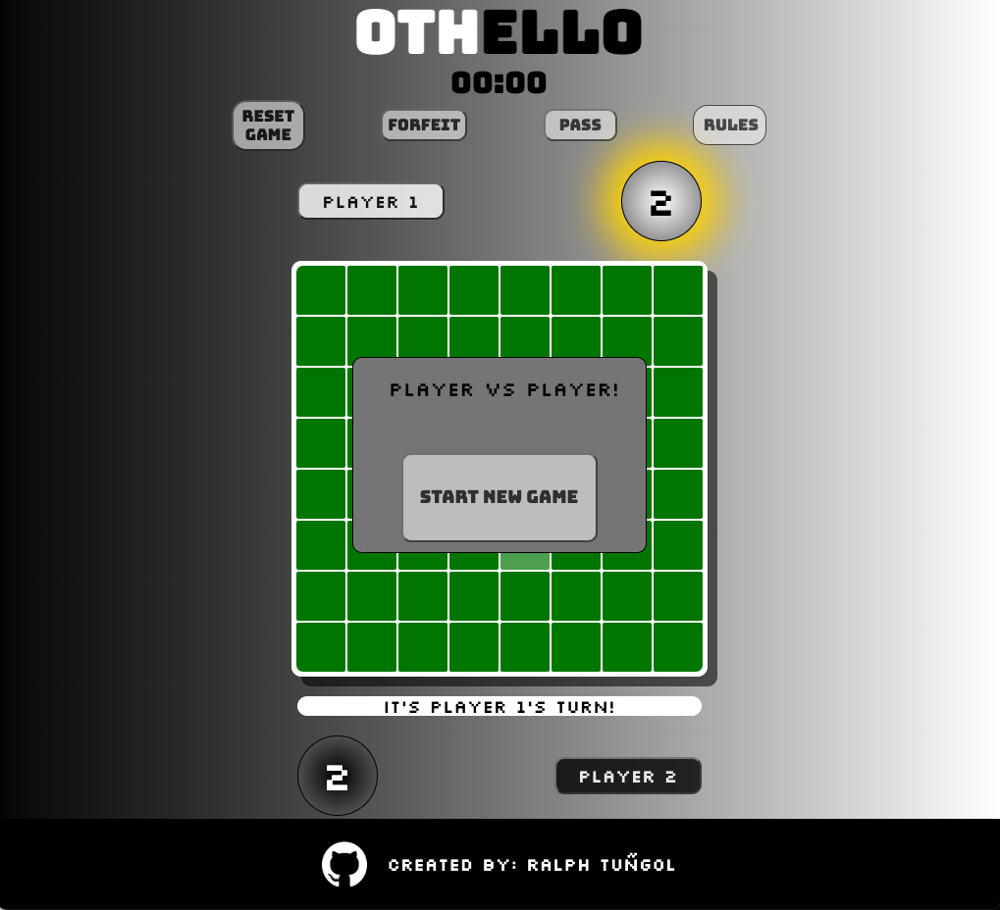

# Othello

### Launch Game
https://tungolra.github.io/Othello/

### Introduction

Othello is a strategy-based game held on a 8x8 grid. The objective is to have the most discs on the board by the end of the game. Players alternate turns by placing a game piece in a position where it is adjacent to their opponents piece and connects to their own piece on the other side of their opponent's piece. The game ends either when the board is filled, when neither player has any possible moves, or when either player completely overtakes the board with their pieces. 

The game begins once "Start Game" is clicked. The number of pieces on the board for each player is dynamically displayed. On the board, boxes are highlight to show possible moves. There is a display below the board that prompts whose turn it is. This is also indicated by placing a box-shadow behind the respective player's scoreboard on their turn. Additionally, the gameboard itself changes it's colour to white or black depending on whose turn it is. 

Players have the option to change their name at any point in the game by clicking on their namebox. 

Players can also pass on their turn if there are no possible moves. The display prompt will prompt the player that they can still go if they attempt to pass. 

Players also have the option to Reset the game (for when the player is facing themselves or an AI), or to forfeit the game (to be used for online multiplayer matches) which will count the pieces on the board and display who won. A win is the result of either player having more points than their opponent. A tie can occur when both players have the same score by the end of the game. 

Players can also toggle the Rules button for a brief overview of how the game works. 

### Building Othello 

##### HTML:

- [x] header container
  - [x] title of game
  - [x] game timer
- [x] options container
  - [x] reset game, forfeit game, pass, rules buttons
- [x] gameboard container
  - [x] player 1/2 container
    - [x] player name input
    - [x] player score div
  - [x] display prompt div
- [x] footer container
  - [x] have link to github repo 
  - [x] author div
##### CSS 
- [x] flexbox structure

##### JS:
- Constants
  - [x] have array interface for board
  - [x] player1/2 score selector
  - [x] selector for display prompt

- Event Listeners
  - [x] add listener when each box in the HTML is clicked
  - [x] add new game function for when game ends
  - [x] add function to toggle rules page

- States
  - [x] gameboard interface with middle 4 pieces filled
  - [x] score for white piece/score for black piece
  - [x] set turn to white piece
  - [x] endgame display selector
  - [x] selector for boxes with possible move class added

- Initialize game
  - [x] Populate gameboard div with 64 divs to render HTML board
    - [x] give each box a class name of box and id of 'data-[div#]'
  - [x] onload function to create HTML board and initialize board
  - [x] initialize board to add prefilled pieces to HTML board by scanning for values != 0

- Functions
  - [x] create handleClick function
    - [x] pass event as parameter, parse box id with getRowCol function
    - [x] should only change values in gameboard interface (GBI) if the value in GBI is 0 & if it's a valid move 
  - [x] create canClickSpot helper function; create getAffectedDiscs helper function
  - [x] when valid move is made: 
    - [x] create flipDiscs function to flip affected discs
      - [x] parses list from getAffectedDiscs function into row and column positions
      - [x] updates GBI to change values (1 or 2) to opposite values
  - [x] create switchturns function to switch turns when valid move is made 
  - [x] create renderBoard function to reinitialize board when GBI is updated 
    - [x] renderboard should check if the game has ended, should reinitialize board to populate HTML, should update player scores
    - [x] if game has ended, should run gameEndDisplay function
  - [x] create endgame function; returns boolean
    - [x] should check if there are no more 0 values on GBI, or if there are no more of one player's pieces on the board, or if the game has been forfeited
  - [x] create gameEndDisplay function
    - [x] gameEndDisplay should set style endGameDisplay to display over board
    - [x] should display prompt of who won and option to start new game
  - [x] create keepscore function 
    - [x] should tally number of discs for each player on each turn 
  - [x] add reset game function
    - [x] should reset HTML gameboard and GBI to original values and intialize game

- Helper Functions
  - [x] getRowCol function to yield array position relative to gameboard interface
  - [x] canClickSpot function to determine if the box selection is a possible move, returns boolean
    - [x] handleClick passes on the row and column of the selected box to canClickSpot to see if clicked box will overtake opposite piece
    - [x] calls on getAffectedDiscs helper function that recursively passes the matrix position of boxes on the board that will flip discs
  - [x] getAffectedDiscs function 
    - [x] scans in all directions relative to click position up to the edges of the board for pieces that could be affected; 
    - [x] collects list of affected discs to pass into flipDiscs function
  - [x] validate pass function 
  
##### JS Features
- [x] highlight possible moves on board
  - [x] should highlight boxes on board that can be clicked
  - [x] should reset depending on player turn
- [x] add forfeit button 
  - [x] should trigger endGameDisplay function to show results
- [x] add change name option 
  - [x] should be able to change name onclick 
  - [x] should change values in display prompt when turns alternate
- [x] add timer 
  - [x] to be added to resetGame function to start and reset
- [x] add highlightFlippedDiscs function
  - [ ] should only highlight affected discs when flipped
- [x] add rules to HTML and button to toggle rules display

next steps

- [x] Readme.md
  - [x] edit pseudocode

##### JS
  - [x] add scoreboard
  - [x] make visible possible moves
  - [x] display turn
  - [x] add pass function
    - [x] turn display should change
    - [x] should only be able to pass if no possible moves available
  - [x] add reset game function (to go in game results display)
  - [x] add endgame function
  - [x] allow players to change name
  - [ ] streamline getAffectedDiscs function
  - [x] replace reset game with forfeit game
  - [ ] disable event listeners on game end / enable event listens on game start

##### CSS
  - [x] add header
  - [x] center board
  - [ ] change cursor at turn
  - [x] add pop up text for rules
  - [ ] make mobile-friendly/ redo css with mobile-first approach

##### HTML
  - [x] static button to start new game (calls on reset game function)
  - [x] button to reset game
  - [x] scoreboard div
  - [x] add rules text
  - [x] add footer
  - [x] button for pass function
  - [x] add display board for game results
  - [x] add github link
  - [ ] add linkedin link

- [ ] Extras
  - [x] animate flipping of discs
  - [x] option to add own name
  - [ ] option to choose avatar
  - [ ] add fullscreen option
  - [ ] add AI
  - [x] display timer
  - [x] set up github page
